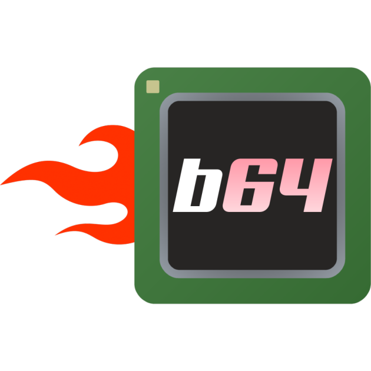

# box64

Linux Userspace x86_64 Emulator with a twist

----

Box64 lets you run x86_64 Linux programs (such as games) on non-x86_64 Linux systems, like ARM (host system needs to be 64bit little-endian).

Because Box64 uses the native versions of some "system" libraries, like libc, libm, SDL, and OpenGL, it's easy to integrate and use with most applications, and performance can be surprisingly high in some cases.

Box64 integrates a DynaRec (dynamic recompiler) for the ARM64 platform, providing a speed boost between 5 to 10 times faster than only using the interpreter.

Some x86 internal opcodes use parts of "Realmode X86 Emulator Library", see [x86primop.c](src/emu/x86primop.c) for copyright details

Logo and Icon made by @grayduck, thanks!

----

Usage
----

There are a few environment variables to control the behaviour of Box64.

See [here](USAGE.md) for all environment variables and what they do.

Note: Box64's Dynarec uses a mechanism with Memory Protection and a SegFault signal handler to handle JIT code. In simpler terms, if you want to use GDB to debug a running program that use JIT'd code (like mono/Unity3D), you will still have many "normal" segfaults triggering. It is suggested to use something like `handle SIGSEGV nostop` in GDB to not stop at each segfault, and maybe put a breakpoint inside `my_memprotectionhandler` in `signals.c` if you want to trap SegFaults.

----

Compiling/Installation
----
> Compilation instructions can be found [here](COMPILE.md)  

----

Version history
----

The change log is available [here](CHANGELOG.md)

----

Final words
----

(If you use Box64 in your project, please don't forget to mention Box64!)
