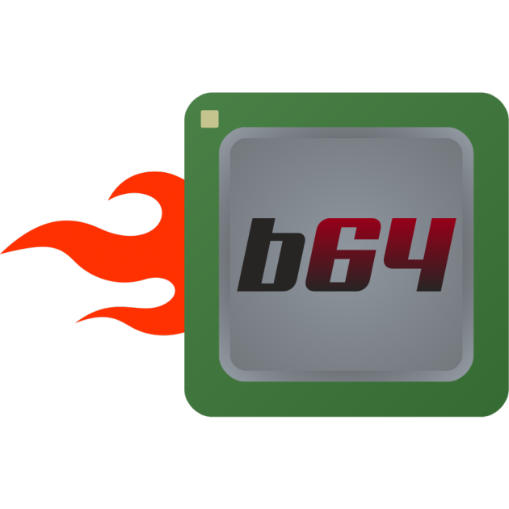

> Внимание: Этот документ устарел. Пожалуйста, помогите нам его перевести.

Емулятор простіра користувача x86_64 із родзинкою

[Дивитись журнал змін](https://github.com/ptitSeb/box64/blob/main/docs/CHANGELOG.md) | [中文](https://github.com/ptitSeb/box64/blob/main/README_CN.md) | [English](https://github.com/ptitSeb/box64/blob/main/README.md) | [Повідомити про помилку](https://github.com/ptitSeb/box64/issues/new)

     

----

Box64 дозволяє запускати x86_64 Linux програми (наприклад, ігри) на системах Linux відмінних від x86_64, наприклад ARM (хост-система має мати 64-розрядний порядок редагування).

Оскільки Box64 використовує рідні версії деяких «системних» бібліотек, таких як libc, libm, SDL і OpenGL, його легко інтегрувати та використовувати з більшістю програм, а продуктивність у багатьох випадках може бути напрочуд високою. Подивіться на цей стендовий аналіз для прикладу [тут](https://box86.org/index.php/2021/06/game-performances/).

Box64 інтегрується з DynaRec (динамічний рекомпілятор) для платформ ARM64 і RV64 забезпечуючи підвищення швидкості в 5-10 разів, ніж використання лише інтерпретатора. Деякі високорівневі відомості про те, як працює DynaRec, можна знайти [тут](https://box86.org/2021/07/inner-workings-a-high%e2%80%91level-view-of-box86-and-a-low%e2%80%91level-view-of-the-dynarec/).

Деякі внутрішні коди операцій x64 використовують частини «Бібліотеки емулятора Realmode X86», дивіться [x64primop.c](src/emu/x64primop.c) для детальної інформації про авторські права.

Логотип і піктограма зроблені @grayduck, дякую!

----

Використання
----

Є кілька змінних середовища для керування поведінкою Box64.

Дивіться [тут](docs/USAGE.md) для перегляду всіх змінних середовища та того, що вони роблять.

Примітка: Dynarec від Box64 використовує механізм із захистом пам’яті та обробником сигналу помилки сегментів для обробки JIT коду. Простіше кажучи, якщо ви хочете використовувати GDB для налагодження запущеної програми, яка використовує JIT-код (наприклад, mono/Unity3D), ви все одно матимете багато «звичайних» помилок сегментів. Пропонується використовувати щось на зразок `handle SIGSEGV nostop` в GDB, щоб не зупинятися на кожній помилці сегмента, і, можливо, поставити точку зупину всередині `my_memprotectionhandler` в `signals.c`, якщо ви хочете перехопити помилки сегментів.

----
Компіляція/Встановлення
----
> Інструкцію зі складання Box64 можна знайти [тут](docs/COMPILE.md).\
> Інструкцію з встановлення Wine для Box64 можна знайти [тут](docs/WINE.md).

----
Історія версій/Журнал змін
----

Історія версій доступна [тут](docs/CHANGELOG.md).

----

Примітки щодо 32 бітних платформ
----
Оскільки Box64 працює шляхом прямого перекладу викликів функцій з x86_64 на хост-систему, хост-система (та, на якій працює Box64) повинна мати 64-розрядні бібліотеки. Box64 не містить 64-біт <-> 32-біт перекладу.

Також розумійте що Box64 запускатиме лише 64-розрядні двійкові Linux файли. Для 32-розрядних двійкових файлів вам потрібен Box86 (з усіма хитрощами з мультиархітектурною системою або корінними правами). Зауважте, що багато інсталяторів (на основі mojo) повертаються до "x86" при виявленні ОС ARM64, і тому намагатимуться використовувати Box86 для налаштування, навіть якщо існує версія x86_64. Ви можете зламати свій шлях за допомогою фальшивого "uname", який повертає "x86_64", коли аргумент "-m"

----

Примітки щодо конфігурації Box64
----

Обидва файли мають однаковий синтаксис і в основному є файлами ini. Розділ у квадратних дужках визначає назву процесу, а решта — встановлють змінну середовища. Подивіться [використання](USAGE.md), щоб дізнатися, які параметри можна завдати. Box64 поставляється з файлом за замовчуванням, який слід встановити для кращої стабільності. Файл знаходиться в `system/box64.box64rc` і має бути встановлен в `/etc/box64.box64rc`. Якщо з певних причин ви не хочете встановлювати цей файл у `/etc`, принаймні скопіюйте його в `~/.box64rc` або гра може не працювати належним чином. Зауважте, що пріоритетом є: `~/.bashrc` > `/etc/box64.box64rc` > командний рядок
Таким чином, ваші налаштування в `~/.bashrc` можуть замінити налаштування з вашого командного рядка...

----

Примітки щодо емуляції ігор Unity
----

Запуск ігор Unity має працювати, але ви також повинні зауважити, що для багатьох ігор Unity3D потрібен OpenGL 3+, який може бути складно забезпечити на ARM SBC (одноплатних комп’ютерах). Крім того, багато нових ігор Unity3D (наприклад, KSP) використовують стиснуті текстури BC7, які не підтримуються багатьма інтегрованими GPU ARM.
Підказка: на Pi4 і Pi5 використовуйте `MESA_GL_VERSION_OVERRIDE=3.2` з `BOX64_DYNAREC_STRONGMEM=1`, щоб запобігти зависанням і ввімкнути режим сильної пам’яті, і використовуйте Panfrost `PAN_MESA_DEBUG=gl3`, щоб використовувати вищий профіль, якщо гра починається, а потім завершується, перш ніж щось показати.

----

Примітки щодо програм GTK
----

Бібліотеки GTK2 і GTK3 тепер використовуються в Box64.

----

Примітки щодо Steam
----

Зауважте, що Steam є гібридом 32-біт / 64-біт. Вам ПОТРІБЕН box86, щоб запустити Steam, оскільки клієнта є 32-розрядною двійковою програмою. Він також використовує 64-розрядні двійкові файли локального сервера, і цей процес steamwebhelper тепер є обов’язковим навіть у «малому режимі». І цей процес з’їсть багато оперативної пам’яті, таким чином машині з 6 Гб оперативної пам’яті знадобиться файл підкачки для використання Steam.

----

Примітки щодо Wine
----

Wine64 підтримується Box64, Proton теж. Майте на увазі, що 64-розрядний Wine також містить 32-розрядні компоненти щоб мати можливість запускати 32-розрядні програми Windows. Для 32-розрядних програм потрібен Box86, і вони не працюватимуть без нього. У системі, де присутні і працюють Box64, і Box86, 64-розрядне встановлення Wine може запускати як 32-розрядні, так і 64-розрядні програми Windows (просто використовуйте `wine` і `wine64` відповідно).
Зауважте, що новий 32-бітний PE в 64-бітному процесі, який Wine зараз реалізує у Wine 7+ тепер підтримується, але підтримка є досить молодою тому можуть виникнути деякі проблеми.

----

Примітки щодо Vulkan
----

Box64 використовує бібліотеки Vulkan, але зауважте що він тестувався з картою AMD Radeon RX550 і драйвером Freedreno, тому деякі розширення можуть бути відсутні залежно від вашої відеокарти.

----

Останнє слово
----

Я хочу подякувати всім, хто зробив внесок у розвиток box64.
Є багато способів зробити внесок: внесок коду, фінансовий внесок, апаратне забезпечення та реклама!
Отже, без особливого порядку, я хочу подякувати:
* За основний внесок у код: rajdakin, mogery, ksco, xctan
* За великий фінансовий внесок: [Playtron](https://playtron.one), tohodakilla, FlyingFathead, stormchaser3000, dennis1248, sll00, [libre-computer-project](https://libre.computer/)
* За апаратне забезпечення та міграцію LoongArch: [xiaoji](https://www.linuxgame.cn/), команда розробників Deepin Beijing
* За внесок у апаратне забезпечення: [ADLINK](https://www.adlinktech.com/Products/Computer_on_Modules/COM-HPC-Server-Carrier-and-Starter-Kit/Ampere_Altra_Developer_Platform?lang=en) with [Ampere](https://amperecomputing.com/home/edge), [SOPHGO](https://www.sophon.ai/), [Radxa](https://rockpi.org/), [StarFive](https://rvspace.org/), [Pine64](https://www.pine64.org/), [AYN](https://www.ayntec.com/), [AYANEO](https://ayaneo.com/), [jiangcuo](https://github.com/jiangcuo)
* За безперервну рекламу Box64: salva ([microLinux](https://www.youtube.com/channel/UCwFQAEj1lp3out4n7BeBatQ)), [PILab](https://www.youtube.com/channel/UCgfQjdc5RceRlTGfuthBs7g)/Команда [TwisterOS](https://twisteros.com/), [The Byteman](https://www.youtube.com/channel/UCEr8lpIJ3B5Ctc5BvcOHSnA), [NicoD](https://www.youtube.com/channel/UCpv7NFr0-9AB5xoklh3Snhg), ekianjo ([Boilingsteam](https://boilingsteam.com/))

І я також дякую багатьом іншим людям, які хоч раз брали участь у цьому проекті.

(Якщо ви використовуєте Box64 у своєму проекті, будь ласка, не забудьте згадати про це!)
